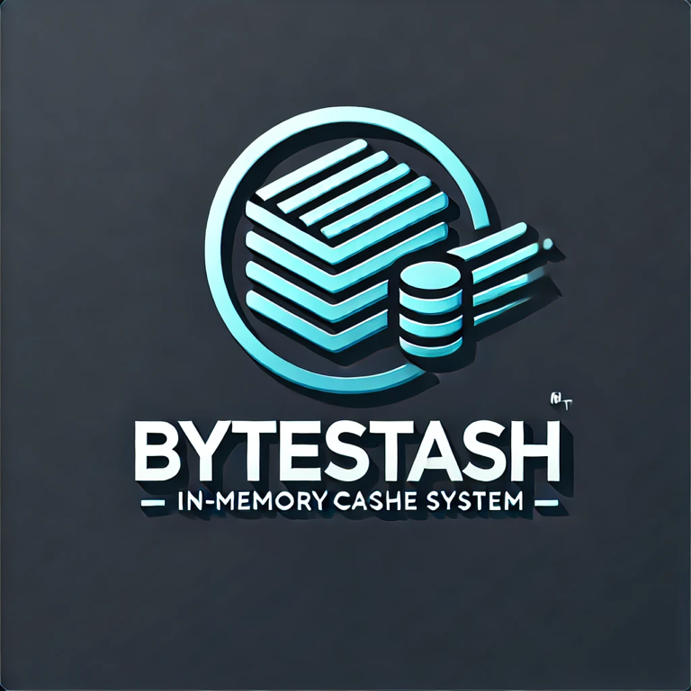

## ByteStash - A High Performance inbuilt Caching tool with multi node capabilities

-------------
ByteStash is an easy to use inbuilt java cache library that is customizable in every aspect, inspiring from Memcached implementation with multi node capability running on different threads.
This cache just like Memcached has three regions hot,warm and cold, refer [Memcached Implementation](https://memcached.org/blog/modern-lru/#:~:text=HOT%20and%20WARM%20LRU%27s%20are,in%20the%20active%20queues%20needlessly.)
for more reference. 
-------------
# Usage 
1) Build the project by taking a clone of main branch and using java 8+ so that all the dependencies are downloaded.
2) Once the jar is installed, use this jar as dependency in your project. 
```xml
<dependency>
<groupId>org.rb98dps</groupId>
<artifactId>ByteStash</artifactId>
<version>1.0</version>
</dependency>
```

3) To create the ByteStash caching, use ```ByteStashFactory``` to create an Instance of ```ByteStash``` with customizable attributes.
```java
ByteStashFactory<Object> byteStashFactory = ByteStashFactory.builder().withNodes(5).withCapacity(50000L).withTimeToLive(100L)
                                                    .withHotPercent(0.1f).withWarmPercent(0.2f).withQueueSize(1000).build();
ByteStash<Object> byteStash = byteStashFactory.getByteStash();
```
4) Generic type ```Object``` is used to store any type of data in the cache, it can be changed to store only specific type of data 
```java
ByteStashFactory<CustomObject> byteStashFactory = ByteStashFactory.builder().withNodes(5).withCapacity(50000L).withTimeToLive(100L)
                                                    .withHotPercent(0.1f).withWarmPercent(0.2f).withQueueSize(1000).build();
ByteStash<Object> byteStash = byteStashFactory.getByteStash();
```
5) Cache can customize the hot percentage and warm percentage just like in memcached, Other attributes that can be customized are:
   * Number of nodes can be customized with max limit of 12, all nodes will run on separate threads
   * Capacity of the number of items can be adjusted to your choice with a minimum value, if not provided default value will be used
   * Time to Live for the item stored in any node, value taken is in seconds
   * For every 4 nodes, one TTLBasedCrawler is created.
   * Queue size for the TTLBasedCrawler that cleans the cache and remove the expired items in every node. 

6) Storing of any object is easy, just call the put method defined in ByteStash object that was created before
```
byteStash.put(keyObject, storeObject);
```
7) So is the retrieving of the Object back from the cache, give the key Object and class type of the object stored, we can store multiple type of object related to same key. 
```java
 StoreObject storeObject = byteStash.get(keyObject, storingObject.class);
```
-------------
# Performance 
To be updated soon

-------------
## Future Prospects
Further progress can be made in these areas:-

1) There is a scope for enhancement with giving the type of eviction policy to the user,other than time based policy.
2) Performance can be improved by using a better serialization library